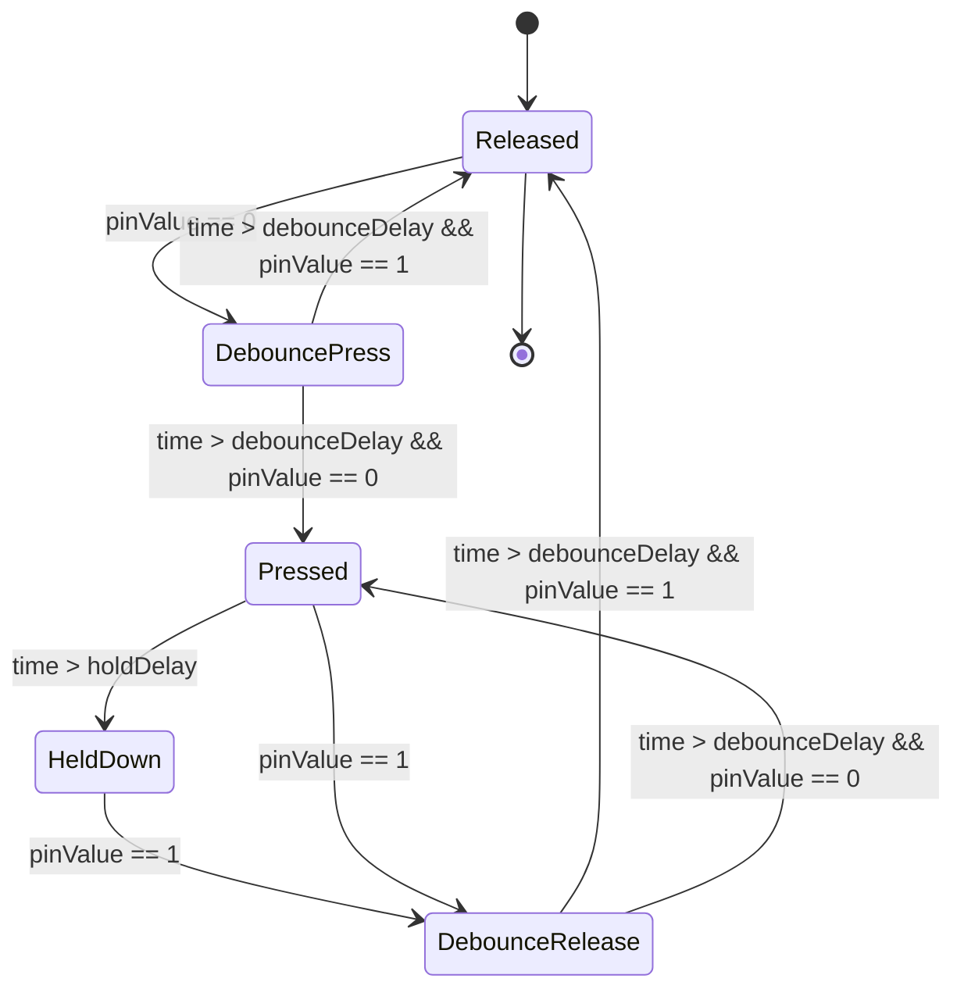

# Overview

```mermaid
stateDiagram-v2
    [*] --> Released
    Released --> DebouncePress: pinValue == 0
    DebouncePress --> Pressed: time > debounceDelay && pinValue == 0
    Pressed --> HeldDown: time > holdDelay
    HeldDown --> DebounceRelease: pinValue == 1
    Pressed --> DebounceRelease: pinValue == 1
    DebounceRelease --> Released: time > debounceDelay && pinValue == 1
    DebouncePress --> Released: time > debounceDelay && pinValue == 1
    DebounceRelease --> Pressed: time > debounceDelay && pinValue == 0
    Released --> [*]

```
