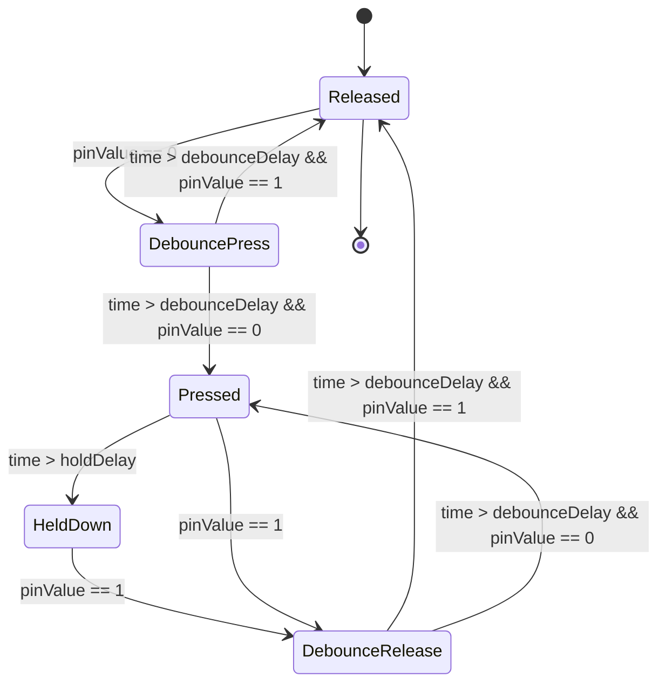
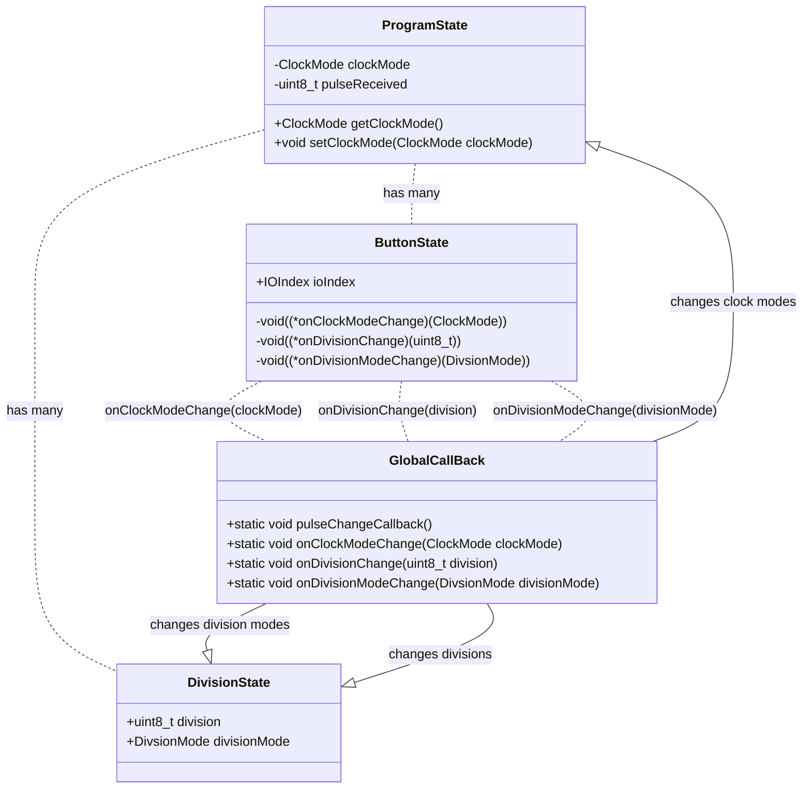

# Overview

# ButtonState -> ProgramState communication schema

Callback explanation.
There are 3 callbacks, we could have probably been better off just pulling ButtonState
about the current state of the classes. Right now, when we change the state of a DivisionState
we are doing it via a callback.
For instance, the # clk
