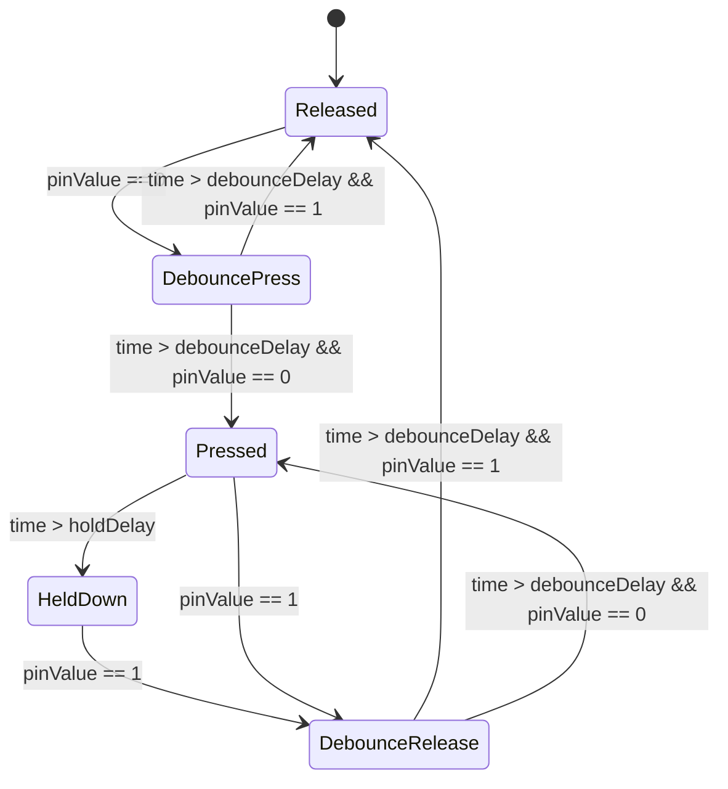
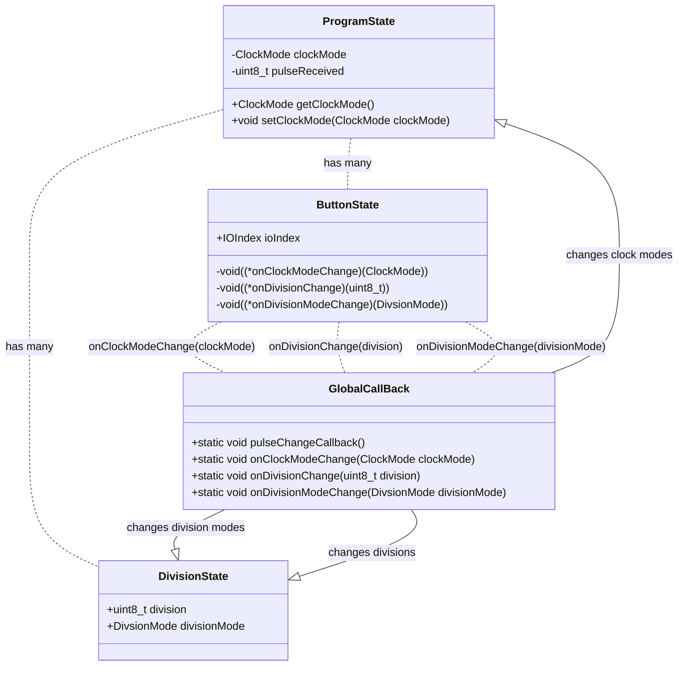

# How it works

Terms:

**Divider** - A physical pin / output jack that pulses out +5v and 0v at a rate which is 1/n of the master clock where n
is the Divider's 

### Various Diagrams and Definitions

# Visual Overview

## Explanation of each State 👆
1. **Released** - Default state, idle state of button before press
2. **DebouncePress**  - State in between released and pressed, we check for jitter interference here before committing to a 
full press
3. **Pressed**  - We have succesfully debounced any jitter and can confidently say that the button is pressed. Big note: this doesn't really do any single thing. this just preceded Release which is the point at which something is actually done.
4. **HeldDown** - We have stayed in pressed state for a long time...
4. **Operation Canceled** - We are cancelling the current operation because the button was not released within a resonable time...
4. **DebounceRelease** - State just before release 

# ButtonState -> ProgramState communication schema

