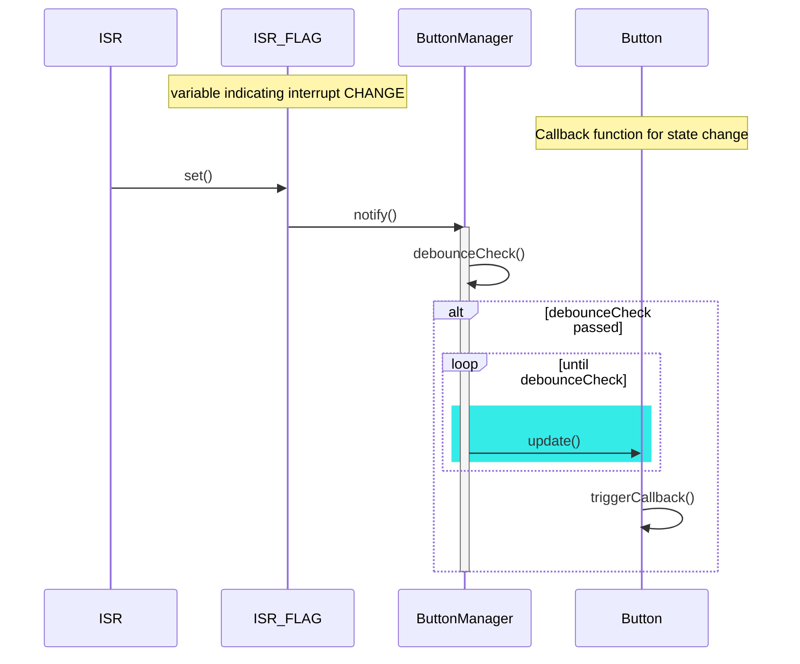
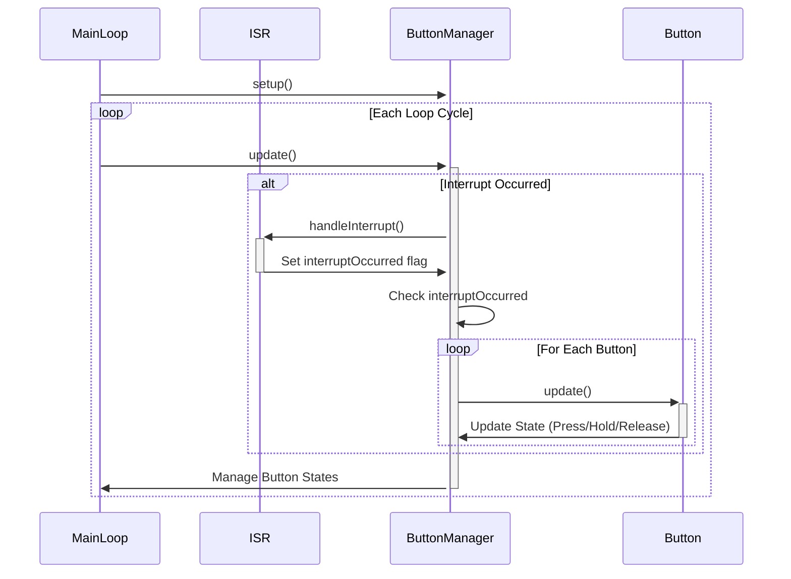
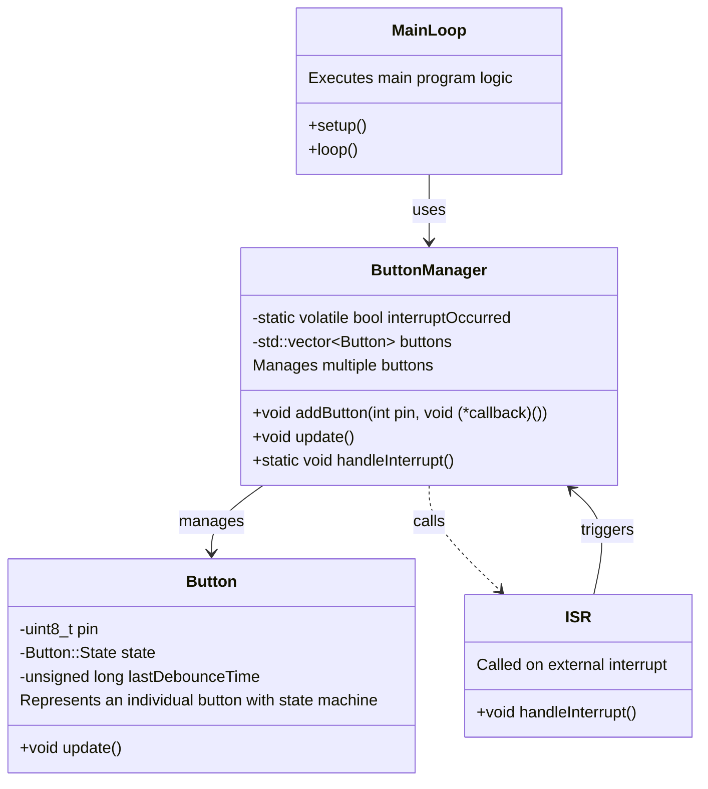
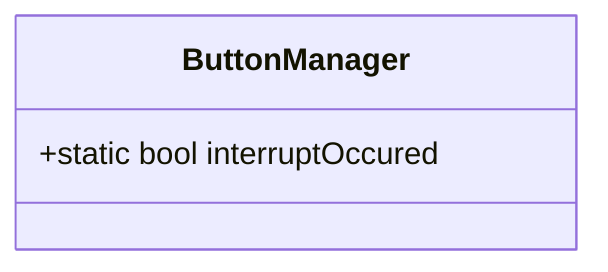
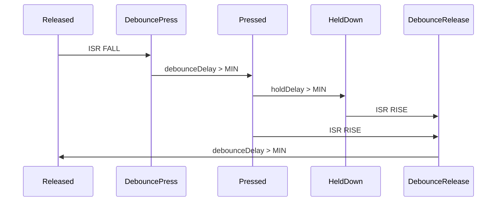

# Overview

```mermaid
stateDiagram-v2
    classDef releasedStyle fill:#FAD9D5,color:black,font-weight:bold,stroke-width:2px;
    classDef debouncePressStyle fill:#f2bb96,color:black,font-weight:bold,stroke-width:2px;
    classDef pressedStyle fill:#C5E4E7,color:black,font-weight:bold,stroke-width:2px;
    classDef dbReleaseStyle fill:#E3E6B5,color:black,font-weight:bold,stroke-width:2px;
    
    class Released releasedStyle
    class DebouncePress debouncePressStyle
    class Pressed pressedStyle
    class DebounceRelease dbReleaseStyle
    
    [*] --> Released: Initialize
    Released --> DebouncePress: Button Press Detected
    DebouncePress --> Pressed: After Debounce Delay
    Pressed --> DebounceRelease: Button Release Detected
    DebounceRelease --> Released: After Debounce Delay
    
    state Released {
        ReleasedState: Wait for Button Press
    }
    
    state DebouncePress {
        DebouncePressState: Verify Button Press 🕒
    }
    
    state Pressed {
        PressedState: Wait for Button Release
    }
    
    state DebounceRelease {
        DebounceReleaseState: Verify Button Release 🕒
    }

    note left of DebouncePress : We haven't verified the press with debounce yet
 

```

| Command       | Description                                     | Example                                   |
|---------------|-------------------------------------------------|-------------------------------------------|
| `run`         | Starts your program                             | `run`                                     |
| `break`       | Sets a breakpoint at a specified function or line| `break main` or `break line_number`       |
| `continue`    | Continues running the program until a breakpoint| `continue`                                 |
| `step`        | Executes the next line of code                  | `step`                                     |
| `next`        | Similar to `step`, but doesn't enter functions  | `next`                                     |
| `print`       | Displays the value of an expression             | `print variable_name`                      |
| `quit`        | Exits GDB                                       | `quit`                                     |
| `info`        | Shows various kinds of information              | `info breakpoints`                         |
| `clear`       | Removes a breakpoint                            | `clear line_number` or `clear function_name`|
| `backtrace`   | Shows the call stack                            | `backtrace`                                |
| `list`        | Lists source code                               | `list` or `list line_number`               |
| `watch`       | Sets a watchpoint                               | `watch variable_name`                      |
| `delete`      | Deletes a breakpoint/watchpoint                 | `delete breakpoint_number`                 |
| `frame`       | Selects a frame from the call stack             | `frame frame_number`                       |
| `set`         | Changes a variable's value                      | `set variable_name=value`                  |
| `disassemble` | Shows the assembly code for a function          | `disassemble function_name`                |
| `info locals` | Lists all local variables in the current frame  | `info locals`                              |

# Understanding Microcontrollers, Registers, and Data Buses

## What is a Register?

A **register** is a small, fast storage location within the CPU itself. It's essentially a collection of flip-flops, each capable of storing one bit of information. The flip-flops are electronic circuits that can hold a binary state—either a 0 or a 1. The number of flip-flops in a register determines its bit-width (e.g., an 8-bit register has 8 flip-flops).

The speed of a register comes from its proximity to the CPU's execution units. It's like having a small notepad next to you when you're working; you can jot something down and refer back to it immediately, without having to go to another room to retrieve a stored document.

## What is Memory (RAM)?

**RAM** (Random Access Memory) is a form of computer data storage that allows data to be read and written in approximately the same amount of time, regardless of the order in which data items are accessed. Unlike a register, RAM is a separate component from the CPU, though modern CPUs often have some form of cache memory integrated to bridge the speed gap between the CPU and main RAM.

RAM is also made up of bit-storage elements, but it's generally slower and consumes more space than CPU registers. Access to RAM goes through the data bus, adding some latency compared to register access.

## What is a Memory Address?

Each location in RAM has a unique identifier known as its **memory address**. This is akin to the numbering in the rows and columns of a huge spreadsheet, allowing you to pinpoint exactly where a specific piece of data is stored.

## What Happens Physically?

When you write a single bit to a memory address, you're changing the state of a specific bit-storage element in RAM, or a specific flip-flop in a CPU register. In silicon chips, these elements are often implemented as tiny transistors configured to hold a charge (and thus a bit). For example, a "1" might be represented by the presence of an electrical charge and a "0" by its absence.

## Data Buses: Physical Structure and Protocol

### Physical Structure

At its simplest, a **data bus** is indeed a collection of physical connections, often copper traces on a circuit board, that link various components. In microcontrollers, these are usually internal pathways etched onto the silicon itself. In systems with an 8-bit data bus, for example, you might have 8 parallel conductive paths connecting the CPU, memory, and I/O ports.

### Protocol and Arbitration

However, it's not just "free-for-all" traffic on these lines. There's a protocol—rules governing the timing and nature of the transactions—that ensures data integrity and order. For instance, you might have a "bus controller" or "arbitration logic" that decides which component gets to use the bus at any given time. This is your "traffic light," as you put it.

### Read/Write Operations

During a read or write operation, the data isn't just sent over the data bus; there are often other signals sent over additional "control lines" to indicate the type of operation, the target address in memory, and so on.

### Clocking

Data transfer is usually synchronized with a clock signal, ensuring that all components know exactly when to read from or write to the bus.
        