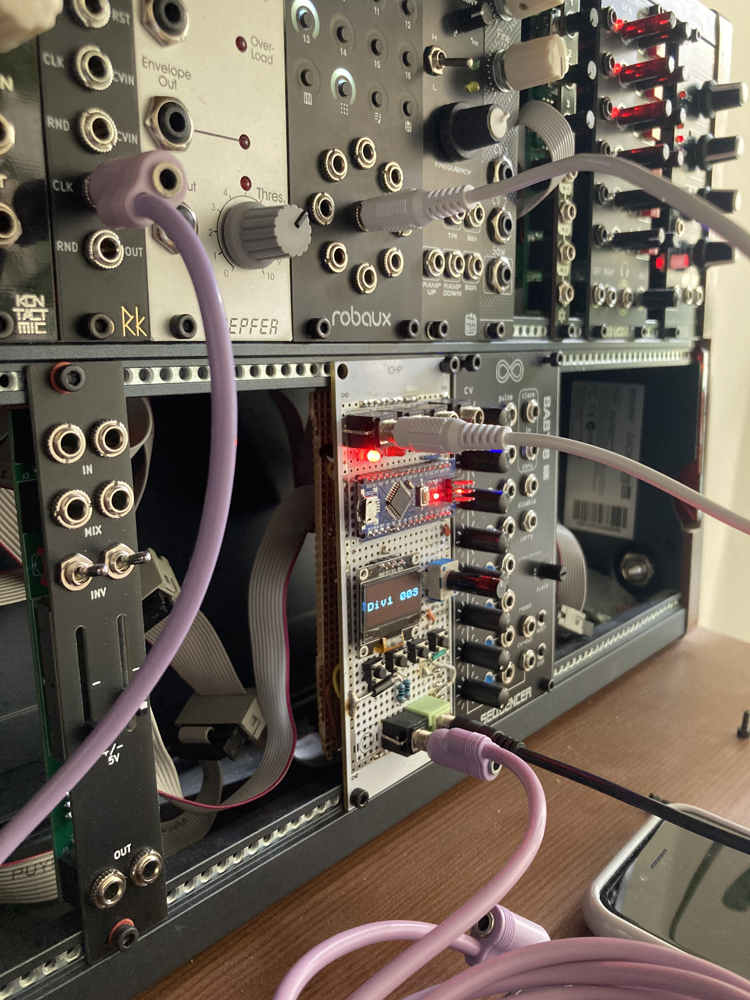
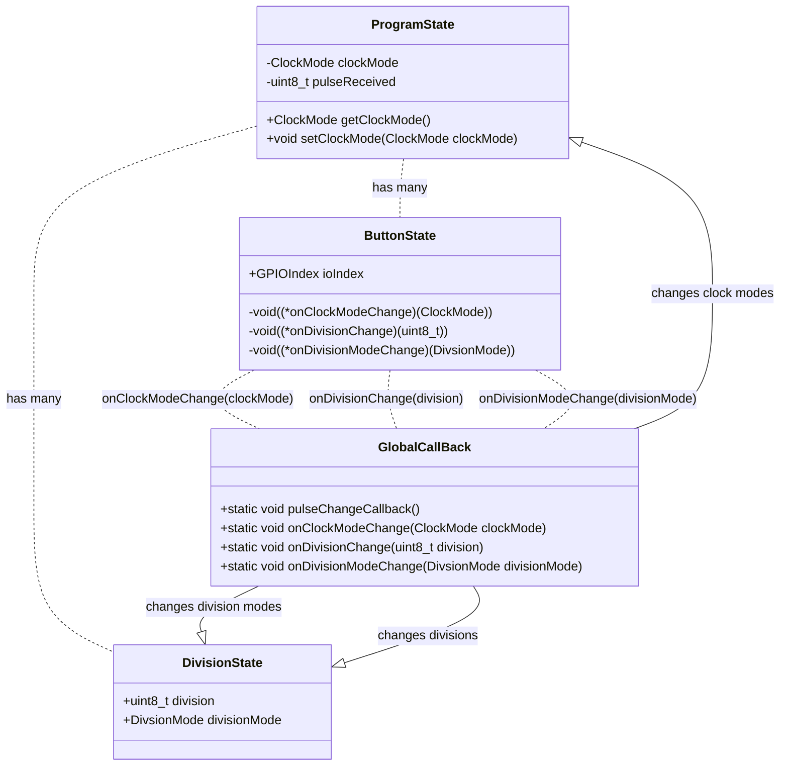

# CLK
### Arduino based eurorack clock source, dynamic clock divider and midi clock source. 

# How to Build and Run

### Dev
Run with logger:

`pio run --environment dev -t upload && pio device monitor -b 9600`

Run tests:

`pio test --environment test`

Build and upload for production:

`pio run --environment prod -t upload`

### Various Diagrams and Definitions

# Visual Overview

## Explanation of each State 👆
1. **Released** - Default state, idle state of button before press
2. **DebouncePress**  - State in between released and pressed, we check for jitter interference here before committing to a 
full press
3. **Pressed**  - We have succesfully debounced any jitter and can confidently say that the button is pressed. Big note: this doesn't really do any single thing. this just preceded Release which is the point at which something is actually done.
4. **HeldDown** - We have stayed in pressed state for a long time...
4. **Operation Canceled** - We are cancelling the current operation because the button was not released within a resonable time...
4. **DebounceRelease** - State just before release 

# ButtonState -> ProgramState communication schema

